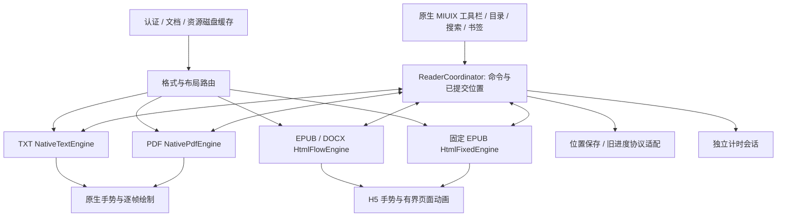

# Android 阅读器分格式翻页重构准备稿

日期：2026-10-05。状态：已完成现状核对与技术方案；`HtmlReader` / `NativeTextReader` / `NativePdfReader`
已按 `ReaderRouter` 接入运行路径，并完成首轮真机复测（结果见 [Android 真机性能复测](android-performance.md) 的 2026-10-05 一节）。

本次目标是让翻页及时跟手、可以连续操作、跨节没有明显停顿，同时保留图文文档的结构。范围是 App 阅读器；Web 的文档显示作为对照，现有目录、搜索、书签、脚注返回、计时与进度接口继续接入。

## 1. 当前实现与重构动因

以下是当前工作区代码的事实，不是帧耗时测量结论。

| 位置 | 当前行为 | 重构要处理的问题 |
| --- | --- | --- |
| `DocumentReader.kt` / `readerHtml`、`readerScript` | EPUB、DOCX、TXT 共用 CSS 多栏与 WebView；节内用 `scrollLeft` 跟手，已有几何和位置锚点缓存 | 单一排版路径不能兼顾长篇纯文本、图文文档和固定版式 |
| `lib/reader-document.ts` / `buildReaderDocument` | EPUB 按 spine 建章节，DOCX 经 Mammoth 转成单个 HTML 章节，TXT 也只有一个章节 | 长 DOCX/TXT 的 DOM 和多栏排版仍随整本文档增长；长 EPUB 章节也存在同类问题 |
| `DocumentController.turn`、`captureBoundary`、`finishTransition` | 原生按钮调用 JS 后等待；跨节使用 PixelCopy、加载新内容和 ValueAnimator，节内手势由 JS 直接处理 | 按钮、节内手势、跨节手势有不同的等待和动画规则 |
| `BookReader.kt` | 同时管理载入、位置、PDF、工具栏、搜索、书签和计时；每 750ms 查询 WebView 位置 | 页面级状态耦合；查询、保存和界面更新容易与翻页工作重叠 |
| `ReaderDiskCache.kt`、`LibraryReaderRepository.kt` | 已有 128MiB 有界磁盘缓存，按服务端、用户阅读键和文档 revision 隔离，每次打开先校验权限 | 缓存的是文档与资源，不是可以直接显示的相邻页 |
| `LibraryScreen.kt` / `PdfDocument` | 原生 PdfRenderer，串行操作，40MiB 位图 LRU；已有前后页预取 | PDF 需要专门的缩放、翻页与预取优先级，不能套用正文多栏 |
| `ReadingDocument`、`ReaderLocation` | 屏幕页与每 2000 个 Unicode 码点的同步进度并存；位置含章节、offset、部分滚动比例 | 新引擎不能把布局页号写入旧服务端进度，也不能丢掉图片页定位 |

现有 App 设计文档中的“所有重排格式每页 2000 字符”和“EPUB/DOCX 不保留图片”的说明已落后于当前代码。本方案以当前代码和用户已确认的阅读行为为准。

## 2. 分格式的渲染决策

H5 是阅读内容与交互代码，CSS 负责排版，WebView 是它们在 Android 上的宿主；它们属于同一条渲染路径的不同层。

| 格式 / 内容 | 主路径 | 分页方式 | 连续滚动方式 | 决策理由 |
| --- | --- | --- | --- | --- |
| TXT | Android 原生 `StaticLayout` + 自定义阅读 View | 后台按实际行高生成页边界，显示层绘制已经准备好的文本页 | 有界段落布局列表，共用文本锚点 | 纯文本不需要 DOM；原生行布局便于控制逐帧工作量 |
| EPUB 可重排 | 本地 H5 + CSS + WebView | 按 spine 章节及必要的语义片段有界排版，H5 内完成拖动、吸附及跨节切换 | WebView 原生纵向滚动，逐步维护内容窗口 | 保留标题、图文、表格、ruby、链接和已支持的出版样式 |
| EPUB 固定版式 | 独立的 H5 固定页面适配器 + WebView | 源页面作为导航单位，整页缩放适配，翻到相邻源页面 | 按源页面连续排列，页面内可缩放 | 不把固定布局塞进文字多栏，不按重排正文裁切图片 |
| DOCX | 转换后的语义 HTML + CSS + WebView | App 侧先建立块索引及有界渲染片段，再使用图文分页引擎 | 同样以有界片段构建纵向阅读流 | 先解决整本 DOM 问题，保留图片、列表和表格；当前转换结果不是 Word 打印版式 |
| PDF | Android 原生 `PdfRenderer` + 页面/瓦片缓存 | 原始 PDF 页与原生跟手动画 | 虚拟页面列表，按需渲染可见页 | 固定页面直接栅格化，放大时提升清晰度，避免 HTML 包装 |

第一版不把 EPUB 或复杂 DOCX 转成纯文本。DOCX 的“纯文字原生快路径”放到后续可选阶段，只有在标题、段落、内联格式、位置映射与选择行为全部等价时才启用，不能仅以“没有图片”判定。

EPUB 固定版式目前只有文档级 `layout` 标记。完整固定页面路径还需要 viewport 尺寸、逐项布局信息等元数据；实施时以兼容扩展补齐，缺失元数据的旧服务端继续使用现有文档展示。不得宣称当前净化后的 HTML 能完整恢复任意固定版式 EPUB。

## 3. 公共架构与职责



统一的是命令、事件、位置、取消规则和用户手感；每种引擎在自己的渲染环境内处理高频手势。原生不会在每个 `touchmove` 等 JS 回调，H5 也不会每帧通过桥接更新 Compose 状态。

建议拆分：

| 模块 | 职责 |
| --- | --- |
| `reader/core/ReaderCoordinator.kt` | 路由、跳转命令、提交位置、取消旧任务；不承担逐帧排版 |
| `reader/core/ReaderAnchor.kt` | 内容锚点、屏幕页身份、旧进度映射 |
| `reader/core/ReaderEngine.kt` | 引擎能力与事件契约，不强制各引擎返回 Bitmap |
| `reader/core/TurnPolicy.kt` | 手势阈值、吸附规则、状态转换及连翻语义；H5 使用同一版本的规则参数 |
| `reader/text/` | 段落索引、后台分页、原生显示、选择与高亮 |
| `reader/html/` | 语义块索引、渲染片段、WebView 宿主、消息桥、固定/重排两种 H5 适配器 |
| `assets/reader/` | H5 模板、CSS、JS 分文件保存；可独立检查，避免继续扩展 Kotlin 巨型字符串 |
| `reader/pdf/` | PdfRenderer 生命周期、串行工作队列、整页和高倍缩放瓦片缓存 |
| `reader/cache/` | 有界布局/相邻页缓存，复用现有下载缓存 |
| `reader/session/` | 阅读计时及服务端心跳，接收已提交进度与真实可读状态 |

现有 `BookReader` 最终只组织阅读工作区、工具栏和面板。目录、搜索、书签通过公共锚点跳转，不读取具体引擎内部页号。

引擎事件至少包括 `ContentReady`、`LocationCommitted`、`NavigationBlocked`、`RenderFailure`；命令至少包括 `Open`、`Turn`、`GoTo`、`SetLayout`、`SetMode`、`Close`。每条异步事件携带 `sessionId`、`generation` 与命令标识，旧文档、旧布局或已关闭页面的回调必须被丢弃。

## 4. 翻页状态与跟手规则

公共状态语义：`Idle → Dragging → Settling → Idle`；目标未准备好进入 `AwaitingContent`，取消或异常回到一个已准备好的稳定页面。

- 手指移动时直接更新当前页与目标页的显示位移；触摸锁定横向意图后才接管，纵向滚动、文字选择、表格横向操作、图片缩放和系统返回手势分别仲裁。
- 单次手势最多提交一页。用位移和速度判断是否吸附；速度决定吸附的方向与时长，不乘成多个页码。
- 动画中再次触摸从当前视觉位移接管；不得跳回动画起点。下一次完整手势有自己的提交机会。
- 按钮、键盘和辅助功能的上一页/下一页使用相同的页边界和提交规则。按钮事件由所属引擎串行执行，队列有上限并明确反馈，不能使用固定 700ms 锁静默吞掉操作。
- 只有吸附到目标后才发布 `LocationCommitted`；取消拖动不保存目标位置。已确定并结束的上一手势不能因新手势被重复提交。
- 跨章节和跨内部片段使用同一种翻页效果。目标未就绪时保留当前内容，给出轻量加载状态；不把空视图当成下一页，也不无限累积翻页命令。
- 收起/打开工具栏只改变覆盖层，不改变正文 viewport；计时器常驻，计时数字更新局限于小组件。
- 减少动态效果时仍有即时跟手反馈，松手后快速定位；持续滚动模式使用正常滚动惯性，不强制单页吸附。

TXT/PDF 由原生 View 执行这些规则；H5 引擎在 WebView 内执行相同规则。一个内容区域只能有一个手势拥有者，禁止父 Compose 和子 WebView 同时消费同一次滑动。

## 5. 各路径的关键实现

### TXT：预分页后直接绘制

先从当前文档的规范化正文与 HTML 标记建立段落和位置映射，避免直接改读原 TXT 后破坏已有 offset。保留空行、段落和单换行语义。

独立后台任务对有界文本窗口创建 `StaticLayout`，按行底部是否超出实际内容高度确定页边界。`StaticLayout` 的 UTF-16 索引转换为规范码点 offset，保证 emoji、组合字符和非 BMP 字符不会被拆断。

缓存当前页、前页与后续两页的布局/绘制数据，优先准备滑动方向；不在绘制回调中重新测量整章。文字页可直接绘制布局，位图仅按实测需要用于过渡，不必把所有页面存成图片。连续模式按段落窗口显示。

原生快路径必须补齐文字选择、复制、搜索高亮与辅助功能文本。自绘 Canvas 本身不提供这些能力；第一版验收不能只看文字出现和翻页动画。

### EPUB 可重排：章节内有界排版，章节边界提前准备

保留出版文档的 HTML 语义及安全 CSS。CSS 多栏仅作用于当前有界片段，屏幕页依实际可见区域生成。正常章节直接作为片段；超长章节使用与 DOCX 相同的语义分块机制。

采用一个附着的 WebView 阅读宿主，第一候选是在 H5 内维护当前与邻接内容的两个独立文档槽位，限制 iframe/DOM 的活跃数量，避免同时常驻三份完整章节。外层 H5 管理一套手势与吸附，子文档不得再安装竞争的手势处理器。子文档脚本仍只能由 App 提供；最小化 `frame-src`、消息来源验证和读者资源白名单。

跨节目标在手指接近边界之前加载、完成资源尺寸确定及排版，再进入可切换状态；在同一 H5 viewport 中移动有界显示槽位，提交后交换角色。普通节内/跨节路径不再依赖临时 PixelCopy。

这两个槽位方案是待验证的技术候选：需要真机证明首帧可见、跨节反向接管、选择和焦点正常。离屏文档“加载完成”不等于已经绘制，禁止靠 `display:none` 预热后直接宣称可用。不能满足门槛时保留旧适配器并重新选择宿主方式，不先切默认路径。

### DOCX：先控制文档规模，再改善翻页

复用当前 Mammoth 转换结果，App 在后台解析已净化的 HTML，建立不可变块索引；采用结构化 HTML 解析器，不使用正则截断标签，也不在主线程解析整本。

内部渲染片段与服务端章节分开。一个 DOCX 仍对应原来的 `document` 章节，片段不重新编号原章节。以段落、标题、列表、图文与表格为分块单位，保存原 offset、fragment 与祖先结构。

- 常规渲染窗口从约 1–3 万码点/有限块数开始调优，数值只是初始实验参数；同时限制 DOM 节点、图像像素和 HTML 字节数。
- 片段边界不是强制换页：分页结果可包含跨片段的续段，图片与后面的 ISBN/说明能自然共页；只有明确的文档换页语义才制造页边界。
- 超长段落按合法文本边界拆成带续段信息的片段；标题与正文、图与题注的组合关系要保留。
- 表格按行安全拆分，超高单行或宽表提供完整内容的局部滚动/展开方式；不能直接裁掉下半部分。列表编号、跨块 float、CSS 兄弟选择器、脚注和重复表头需要专门处理。
- 内部窗口裁剪前保留当前可见锚点和显示位置，在布局稳定后补偿位移；反向阅读复用已缓存边界，不能每次重算整书。

语义分块是本次风险最高的部分。首先用真实 DOCX 验证无漏段、重复、错误编号和图片裁切，再推广到超长 EPUB 章节。任意文档 CSS 无法保证完全独立拆分，无法安全分块的结构保留完整子树并使用局部连续展示，不牺牲正文完整性。

### 固定版式 EPUB：页面与正文重排分离

根据源 viewport 计算页面缩放，默认完整显示。图片与文字维持同一源页面的相对关系；页内缩放时手势用于平移，在正常适配比例时用于翻到下一源页面。识别 EPUB 的阅读方向；竖排、RTL 与混合布局进入单独兼容场景，不能沿用只按 `scrollLeft` 计算的 LTR 公式。

### PDF：渲染队列与显示解耦

将现有 `PdfDocument` 移出书架文件，建立单一工作队列。当前目标页优先于相邻页预取；一次底层渲染无法即时取消时，完成后丢弃过期结果，再立即执行最新目标。预取失败不覆盖当前成功页。

适配比例缓存整页预览，放大后只提高可见瓦片的分辨率，按文档 revision、页、分辨率档、旋转与区域构建缓存键。缓存按字节预算而非固定页数管理。正常比例单指跟手翻页，放大时单指平移、双指缩放；边缘翻页需明确仲裁。

连续滚动使用虚拟页面列表，可见页优先渲染。PDF 搜索、选择与目录能力按设备 API 和可用解析能力显式声明；不能把 API 35 的文本能力当成 minSdk 26 设备都具备。预取缓存也不等于已经接入这些功能。

## 6. 锚点、缓存与计时兼容

### 位置

主位置是 `documentRevision + sourcePath + blockId/fragment + codePointOffset`；图片/固定页面另带元素或源页面身份和页内归一化位置。滚动比例仅作为缺少文本/元素定位时的后备。

`ScreenPageId` 包含布局版本及该页首尾锚点，是本机布局产物，字号、屏幕和字体改变后重新生成。原服务端每 2000 码点的进度仍通过兼容适配器计算，不得改成当前“屏幕第几页”。图片页可能映射到同一个旧进度页，本机必须保存更精确的元素锚点；要跨端精确同步再单独扩展协议。

首阶段从 v1 文档派生本地块索引，服务端接口和 Web 无需迁移。旧书签的章节 index/offset 在相同 revision 下映射到新锚点；换文件或文档 schema 改变产生不同 revision 时不能盲用旧 offset。搜索结果、脚注返回、模式切换和旋转都使用同一位置模型。

### 缓存与失效

| 层 | 内容 | 失效条件 |
| --- | --- | --- |
| 已有磁盘缓存 | 文档 JSON、图片、原 PDF 等资源 | 服务端/账户/revision 变化，校验失败，磁盘回收 |
| 新增索引缓存 | 语义块、码点映射、分页边界/检查点 | 内容 revision、分块器或排版器版本变化 |
| 内存显示缓存 | 可直接绘制的文本页、PDF 预览/瓦片、已就绪 H5 邻接文档 | 布局变化、内存压力或离开阅读器 |

布局键至少包含 viewport、实际字体及字号、系统字体比例、行距、边距、阅读方向、引擎版本；WebView 路径额外包含 WebView 版本、CSS/资源尺寸签名。夜间图片滤镜或文字颜色如影响绘制需使显示缓存失效，不必重算文字页边界。

图片先获取尺寸并保留正确纵横比，后台解码；迟到资源改变布局时增加 generation、保住已提交锚点并重建邻接窗口。位图、原始字节与活跃 DOM 一起计入内存评估，避免三层缓存各自看似有界、合计超出预算。

精确锚点在提交页/滚动稳定后合并保存，后台和退出立即刷新；去掉常态 750ms 全量轮询。保留有界的恢复查询处理丢失事件。计时会话不随渲染器替换而重建，不随动画逐帧触发心跳；目标载入到无可读内容的期间暂停，已准备好的正常翻页不暂停。

### 防止再次空白与冻屏

- viewport 使用原生实际测量尺寸，不能只依赖有问题的包含块百分比高度；尺寸为零时不提交准备完成。
- WebView 读取完成、JS 已恢复位置、关键资源尺寸确定、视觉可绘制分别核验。`onPageFinished` 单独不足以发布可读状态。
- 保留旧的可读页面直到新内容就绪；超时要回到旧页或显示明确可重试错误，不能只解除锁后展示空白。
- 当前工程出现过 WebView 与祖先合成层相关的空白回归；新方案避免通过整个 Compose 内容祖先的 alpha/scale 实现过渡，真机验收后才启用新的合成方式。
- 保留内容 source token、generation 与销毁检查。退出时取消后台分页和预取，销毁 WebView，关闭 PdfRenderer，避免旧回调污染新书。
- 背景触摸拦截只在背景兄弟层，不能重新包住可滚动阅读器/书架祖先。

## 7. 实施顺序与完成门槛

每步均可单独回退，第一阶段适配现有引擎，不同时替换所有格式。路由开关放在内部配置，不给普通用户增加技术设置。

| 阶段 | 交付 | 切换门槛 |
| --- | --- | --- |
| 0：真实基线 | 当前版本各格式的帧轨迹、空白/跨节行为与固定样本文档 | 记录设备、WebView、刷新率、冷热缓存和热状态，能够重复比较 |
| 1：抽公共层 | 内容锚点、引擎事件、格式路由、独立计时；旧引擎作为适配器 | 旧功能与阅读位置无回归，能立即切回 |
| 2：TXT 原生 | 有界原生排版、跟手翻页、连续滚动、选择/高亮 | 长文本连续翻页不随书长明显恶化，特殊字符和换字号位置正确 |
| 3：DOCX 有界 HTML | 块索引、片段连续排版、资源尺寸预处理 | 真实大 DOCX 明显改善，所有文本/图片/表格保全，片段边界不强制分页 |
| 4：EPUB 双路径 | 重排路径复用安全分块和邻接预热；固定版式独立路径及必要元数据兼容扩展 | 跨 spine 跟手、首末页正常，图文/目录/脚注/固定页面不空白 |
| 5：PDF 队列/瓦片 | 跟手、预取优先级、缩放清晰度、连续页面列表 | 高分辨率与反向连翻不卡在预取后面，缓存可回收 |
| 6：收敛 | 移除被替代的 PixelCopy 常规跨节链和原生/JS 双重锁，完善 MIUIX 工具联动 | 真机业务与性能都达标后再移除旧路径 |

## 8. 验证与性能目标

准备阶段只检查方案和代码对应关系，不安装 App、不改设备数据、不添加新的业务 E2E 脚本。实施时保留有意义的现有单元/真实 WebView 测试，以真实文档和人工业务操作验收体验。

固定样本包括：大 TXT；中英文/emoji/组合字符；大量标题、嵌套列表、内联格式、图片+ISBN、宽表/超高表格、长段落 DOCX；普通、单章超长、图片页、SVG 封面、nav-only、固定版式、RTL/竖排 EPUB；扫描与文字 PDF。测试资源需合法可用，不写入账号凭据。

人工业务流程：连续快翻至少 100 页、反向连翻、动画中重新拖动/取消、跨节往返、末页、目录/搜索/书签/脚注返回、冷启动恢复、字号/横竖屏/模式切换、工具栏弹层、慢资源/失败重试、后台退出、切换账户、文件替换、缓存损坏与内存压力。

性能分别测“触摸到首次视觉变化”“目标页就绪”“吸附动画帧”“跨节等待”“内存峰值”。使用 benchmark 变体的真机 Perfetto/FrameTimeline；如引入 Macrobenchmark，专门建性能模块，不把桌面 Chromium 时间作为手机证据。WebView 子进程也要纳入轨迹分析，单看 Compose CPU 时间不够。

建议初始门槛（是目标，尚未测得）：

- 缓存热、目标页已就绪时，手势锁定后两次显示刷新内出现跟手反馈；每次完整手势只提交一页。
- 以真实刷新周期为预算：60Hz 约 16.7ms、120Hz 约 8.3ms；稳定连翻窗口的帧超期率目标低于 1%，记录 P95/P99 及最差帧，跨节单列报告。
- 预热好的跨节与节内使用同一吸附路径，不能增加一次串行网络等待或截图等待。
- 连翻后返回相同页内容和锚点一致；所有样本文档零丢段、零意外空白、零图片裁切回归。
- 经多轮打开/退出与长时间连续阅读后内存回到稳定范围；遇到内存压力先释放邻接预取，不释放仍在显示的资源。

性能优化是否有效，以同设备、同样本、同缓存状态的基线对照和人工操作结果共同判断；编译、lint 或功能测试通过不能代替流畅度结果。

## 9. 技术依据

- [Android StaticLayout.Builder](https://developer.android.com/reference/android/text/StaticLayout.Builder)：原生文本布局的可用基础，本工程 minSdk 26 覆盖其 API 23 起的 Builder；分页与选择仍需自行实现。
- [Android PdfRenderer](https://developer.android.com/reference/android/graphics/pdf/PdfRenderer)：原页面栅格渲染，底层操作需要按其生命周期/线程约束组织，耗时工作离开 UI 线程。
- [Android WebView / postVisualStateCallback](https://developer.android.com/reference/android/webkit/WebView#postVisualStateCallback(long,%20android.webkit.WebView.VisualStateCallback))：DOM 更新与视觉绘制异步；回调只保证对应更新准备绘制，宿主可见/附着条件仍需满足。
- [Foliate.js 渲染器](https://github.com/johnfactotum/foliate-js)：可重排与固定页面分离、按位置锚点导航；CSS 多栏有性能及兼容性限制。借鉴分层与按节控制工作量，不承诺直接替换库即可消除卡顿。
- [Android Macrobenchmark 帧指标](https://developer.android.com/topic/performance/benchmarking/macrobenchmark-metrics)：`frameOverrunMs` 用于观察超期，`frameDurationCpuMs` 用于 CPU 工作；需要结合系统轨迹定位 WebView 绘制。

### 9.1 Readest / foliate-js 的分阶段执行（2026-10-05 对照）

上游 `johnfactotum/foliate-js` 的 `paginator.js` **没有**分页循环：分栏交给浏览器 CSS 多栏，`expand()` 只读一次 `getBoundingClientRect()`，按 `ceil(总长/单页)` 撑开，没有步长、时间预算或 rAF 分片；唯一的逐帧循环是 300ms 翻页滚动动画；`getVisibleRange()` 里的 `bisectNode()` 每次比较都强制同步布局，是他们滚动时的热点。切章会销毁并重建 iframe，layout 不跨 section 复用。

Readest 维护的 fork 在这一层之外加了分阶段的**窗口管理**，这部分才是可借鉴的：

| 机制 | 他们的做法 | 我们当前（`host.js`） |
| --- | --- | --- |
| 阶段粒度 | 一个 rAF 回调只做一个 section 的加载或一次样式应用，阶段之间 `yieldToFrame()` 让帧 | 一个 `load()` 做一整个描述符（最多 3 段 + `tail()`），阶段边界是 `onload`/图片/双 rAF |
| 非必需内容准入 | 需**连续 2 个空闲 rAF 帧**；触摸中或动画中计数清零，不在抬手到吸附之间插入布局 | 10.2 改为“吸附动画期间不起新文档，动画结束后重试”，意图等价，但用超时驱动 |
| 前向缓冲 | `minPages = 5` 页，同时驻留 `maxSections = 8` | 描述符 3 段窗口 + `tail()` 重建 |
| 裁剪 | 距离 10 页才销毁，且**只裁主 section 之后的**，删前面的会改变滚动位置 | 按屏整体替换描述符；连续滚动模式两端裁剪并补偿锚点 |
| 就绪语义 | `#stabilizing` 保持到填充完成；主 section 呈现是 7 段流程（opacity 0 → 加载 → 校验 → 方向缓存 → 前一节 → 锚点 → opacity 1） | 就绪 = 桥接首次发布位置（含几何、首图、双 rAF 绘制机会） |
| 在途去重 | `#fillPromise` 由 `turnPage`/`goTo` 复用，`#views.has(index)` 直接跳过 | `nextJob`/`previousJob` 加 10.2 新增的 `spareTarget` 复用 |
| 相邻 section 复用测量 | fork 把 `#lastLayout` 传给相邻加载，不重复测量 | 每次加载都重新 `geometry()` 测量 |
| 方向守卫 | 书写方向不一致的 view 立即销毁，方向边界停止预加载 | 未处理，留待固定版式路径 |

结论：上游把分页成本交给浏览器多栏引擎，Readest 用窗口 + 空闲帧门控控制“同时处理多少内容”；两者都**不在一个文档里装整本书**——这正是 10.6 要补的部分，也是大文档 OOM 的结构性原因。优先可借鉴：连续空闲帧门控（10.2 的小幅收紧）、只裁主 section 之后（10.1）、相邻节复用 layout 测量结果（新增项）。

尚需在阶段 0–4 通过原型解决的技术风险：H5 邻接槽位是否真正提前可绘制；复杂 CSS 的分块保真；固定 EPUB 元数据与净化策略；TXT 原生文字选择；API 26–34 的 PDF 文本能力。以上风险有对应阶段门槛，未通过前不替换默认引擎。

## 10. 2026-10-05 首轮真机复测后的优化优先级

本轮只拿到两个 Janky 占比（DOCX 连翻 0.10%、EPUB 含跨节 4.39%），不足以指认瓶颈。
以下按“命中场景 × 改动代价”排序；每条都附验证方式，未通过复测前不写成已完成的优化。

### 10.0 实施状态（2026-10-05）

| 项 | 状态 | 落地内容 |
| --- | --- | --- |
| 10.2 | 已完成 | `prepare()` 的 idle 预热在吸附动画期间不再起新文档，改为等动画结束后重试；`warm()` 记录 `spareTarget`，同一目标已就绪时直接复用备用槽位，不再重新解析同一文档；`goTo`/`cancel` 清理备用槽位状态；新增 `lastDirection` 作为预热方向 |
| 10.3 | 已完成 | `load()` 只等第一张未完成的图片（原来等齐该片段内所有图片，每张最多 3s）；图片到达后的重排与发布合并到一帧内做一次，不再逐张触发全量重排 |
| 10.4 | 已完成 | 节内拖动与吸附改为对 `#flow` 做 `translateX` 合成位移（`slide()`），提交时才写 `scrollLeft`；`pageAnchor`、`tail`、`seek` 按 `view.slide` 换算布局位置，切到相邻帧时复位；`will-change` 只在位移期间加 |
| 10.5 | 部分完成 | 阅读计时状态改为每秒发布一次（原每 250ms 写状态，导致状态条重组并重绘）；翻页提交到会话上报改为 700ms 合并。**“每屏提交导致整屏重组”的重构未做**：DOCX 0.10% 说明它不是当前主要开销，且该改动涉及 `BookReader` 主体与工具栏签名，需要先有基线再动 |
| 10.1 | 已完成 | 章内前进改为**原地增长**：把下一批片段追加到当前 flow（`<section data-reader-piece>`），只在落后 `WINDOW_KEEP=3` 个片段时退役头部（最多常驻 `WINDOW_PARTS=4`），退役后按保留锚点重新 `seek`，因此不再为新窗口重建文档。拖动/吸附仍走合成位移；跨章边界才换文档。`isBoundary` 在章内改为“先增长、失败再回落 `cross`”（原 `tail()` 重建保留为回退） |
| 10.6 | 已完成 | host 文档只带元数据，章节正文按 `/reader/chapter/{i}` 逐节取用：Kotlin 侧 3 条目访问序窗口缓存，长章节的块索引只对真正读到的章节计算，且计算发生在 WebView 请求线程（不占 UI 线程也不占渲染主线程）；H5 侧按同一窗口缓存并对同一章节做在途去重。CSP 补 `connect-src 'self'`。大文档不再生成整本字符串，OOM 的结构性原因由此消除 |
| 10.7 | 部分完成 | 已删除无人调用的 `DocumentReader` 组合函数与 `ReaderPageSource`（应用里再没有构造旧阅读视图的入口，旧路径无法成为回退）。`DocumentController` 的旧 WebView/PixelCopy 分支**保留**：`ReaderPaginationTest`（19 项）仍通过它驱动旧引擎；R8 优化包会把这些成员一并删除。彻底收敛要么把该套测试迁到新引擎，要么连同 `readerHtml`/`readerScript` 一起退休，建议放到 10.8 复测之后 |

本轮验证：`:app:compileDebugKotlin`、`:app:compileDebugAndroidTestKotlin` 通过；`node --check host.js` 通过；
真机 `ReaderEngineTest` 10 项（跨节双向、长章节 110 次连翻的有界 DOM 与单调偏移、反向逐页精确回退、
取消跨节动画、固定页面滑动、图片/表格）通过——10.1 的原地增长 + 退役由这组用例覆盖；
`:app:assembleBenchmark`（R8 优化包）构建通过。
`ReaderPaginationTest` 19 项在 10.1 落地后已通过一次；10.7 改动（删除无人调用的组合函数，控制器复原）
之后的重跑因测试机无线 ADB 在跑到第 7 项时掉线而中断，需要在设备恢复后补跑。
10.2–10.6 的收益仍需按 10.8 的分组复测确认，不能在复测前写成“已改善”。

### 10.1 跨节不重建整篇文档（最高优先）

`host.js` 的 `cross()` → `warm()` → `load()` 每次跨节都新建一份 iframe 文档：`srcdoc` 整篇重新解析、
样式与字体重建、多栏整体布局；`tail()` 还要把上一份文档的尾部 `cloneContents()` 后 `innerHTML` 序列化，
再嵌进新文档。同一 spine 内的片段前进也走同一条路，而连续滚动路径已经有 `extendScroll`/`trimScroll`
的增量窗口机制可选。

改法：按屏路径在章节内改为原地追加下一片段、退役已读片段并补偿 `scrollLeft`，只有真正换 spine 才换文档；
`tail()` 用 DOM 迁移代替字符串往返。验证：同章节内跨片段翻 20 屏与真正跨 20 节分开记录，前者应回到节内翻页的量级。

### 10.2 相邻内容的准备不要和手势、动画抢渲染线程

- `prepare()` 的 `requestIdleCallback(..., {timeout:300})` 只挡了 `touch` 和 `pending`，没有挡 `animation`；
  90–200ms 的吸附动画期间仍可能启动一次新文档解析。
- `warm()` 先无条件 `spare=null` 再重载目标：用户来回跨边界或取消拖动后，同一个目标会被完整重建。
  应按 `desc.id` 与目标屏记住已就绪的备用 frame，命中即复用。
- `touchstart` 就无条件 `warm(drag>0?-1:1)`，方向未定时即可触发一次解析；改为越过 10px 判定后再起。

验证：抓一次跨节往返的 Perfetto/`framestats`，确认新文档解析不再与吸附动画落在同一帧区间；
跨节等待与帧超期分开报告。

### 10.3 图片不要等齐、也不要每张都重排

`load()` 把 `image.loading` 设为 `eager` 并 `Promise.all` 等齐该片段内所有图片（每张最长 3s），
图片到达后每张又各触发一次 `geometry()` + `seek()` + `prepare()` + `publish()`。一章多图时，
这既是跨节变慢的来源，也是动画结束后连续多次全量重排与桥接发布。改法：只等首屏可见的图片，
其余保持懒加载；用资源元数据给出宽高或 `aspect-ratio`，使图片到达不改变布局；把 load 回调合并成
一次批处理重排、一次发布。验证：同一章节分别用有图/无图版本对照，先做这一步的快速 A/B。

### 10.4 统一翻页动画的合成方式

节内翻页的 `paint()` 每帧写 `viewport.scrollLeft`，等于让渲染线程按帧重绘多栏内容；只有跨节用 `transform`。
改法：节内也改为对内层做 `transform` 位移，`scrollLeft` 只在提交时写一次；`#flow` 加 `contain: layout paint`，
`will-change` 只在滑动期间加，避免常驻显存。验证：同章节连翻 20 屏的 P95/P99 与最差帧。

### 10.5 应用侧每屏提交的 Compose 开销

`DocumentController.publish()` 每次提交写 6 个状态，而 `BookReader` 主体读了 `chapter`、`offset`、`fragment`、
`initialScrollFraction`、`page` 和 `controller.screenPage`，并在主体里拼 `progress` 字符串，
于是每屏提交都会重组整个阅读器子树（含 `AndroidView` 的 `update` 与 `ReaderControls` 的三个 `AnimatedVisibility`）。
另外 `readingMillis` 每 250ms 写一次状态，`LiveReaderStatus` 随之每 250ms 重组一次。

改法：位置状态收敛到一个 `MutableState<ReaderPosition>`，只由状态栏与工具栏小组件读取；`progress` 用
`derivedStateOf` 或在子组件内计算；传给 `ReaderControls` 的回调 `remember` 固定实例；计时显示降到 1s
且仅在 `ready` 时更新。验证：这一项对 DOCX 与 EPUB 都应有效，可先用 DOCX 做不回归对照。

### 10.6 打开与内存（与本次 jank 不同源，但同样代价高）

`HtmlReader.markup()` 把整本 `chapters[].html` 塞进一个 JSON 字符串，首次打开即解析整本并常驻 JS 堆；
`ReaderAssetClient.shouldInterceptRequest` 每张资源一次 `runBlocking`。改法：章节 HTML 按需经本地路径 +
磁盘缓存取用，首屏只带目录与邻居；在 `warm` 时顺带预热下一章的资源。验证：打开耗时、PSS 与首次进入首屏的空白/等待。

### 10.7 收敛旧路径

`DocumentReader` 组合函数与 `readerHtml`/`readerScript` 现在只服务真机 WebView 测试；
`DocumentController` 里的 PixelCopy / `previousFrame` / `transitionProgress` 跨节截图链只在没有 `engine` 时才生效，
运行路径已走不到。按第 6 阶段的要求，真机达标后删除；在此之前至少不要让它重新成为回退路径。

### 10.8 归因复测要求

只有把下面几组分开，4.39% 才能落到具体改动上：

| 组 | 场景 | 关注 |
| --- | --- | --- |
| A | 同一章节内连翻 20 屏 | 节内动画与提交开销 |
| B | 连续跨 20 节 | 文档重建、图片、样式重建 |
| C | 有图章节与无图章节对照 | 图片路径的贡献 |

同设备、同文档、同模式（都按屏翻页）执行；输出 Janky%、P95/P99、最差帧，跨节等待与内存峰值单列；
用 `framestats` 或 Perfetto 分清 Slow UI thread 出现在“提交位置后的重组”还是“新文档导航/提交”，
并把 WebView 渲染进程纳入轨迹。换 `benchmark` 变体复测，避免用开发构建的结论替代验收。

## 11. 下一轮规划：把阅读器做到接近原生（2026-10-05）

先把“接近原生”变成可测门槛，否则无法验收。基准用同设备、同文档、同模式下**原生 TXT 路径**（`StaticLayout` 分页、可选择的 `TextView` 显示）的实测值，
而不是凭手感判断。

### 11.1 固定验收门槛（数字是目标，实测前不能宣称达标）

- 连翻 20 屏：零超期帧；P99 ≤ 一个刷新周期（60Hz 16.7ms、120Hz 8.3ms）。
- 跨节：无可感等待，目标页就绪 ≤ 100ms，且不打断已经开始的手势。
- 冷开书：书架点击到首屏可读 ≤ 300ms。书籍持久缓存热、阅读引擎冷与缓存冷分别报告；应用冷启动另测，不用 TTID 冒充首屏可读。
- 内存：同书峰值 ≤ 原生路径的 1.5 倍；连续阅读 10 分钟后回到稳定区间。
- 测量沿用 10.8，并补 Perfetto/FrameTimeline；WebView 渲染进程必须纳入轨迹，否则会把渲染器的时间误判成 UI 线程。

### 11.2 P1 测量与预编译（先做，成本最低）

- 建独立性能模块跑 `Macrobenchmark`：冷开书、首屏、连翻 20 屏、跨节 20 次，采 `frameOverrunMs` 与 `frameDurationCpuMs`。
- 生成业务 Baseline Profile（书架→开书→首屏→连翻）并按官方 DEX 布局建议补 `startup-prof.txt`。
  本项目目前只有依赖自带的 ART profiles，没有本应用业务路径的 Baseline Profile；Baseline Profile 的定位正是让关键交互“第一次运行就顺”。
- 依据：[Baseline Profiles 概览](https://developer.android.com/topic/performance/baselineprofiles/overview)、[DEX 布局与启动配置文件](https://developer.android.com/topic/performance/baselineprofiles/dex-layout-optimizations)、[UI jank 检测（FrameTimeline）](https://developer.android.com/studio/profile/jank-detection)。

### 11.3 P2 常驻窗口与双向预热（结构性，预期收益最大）

- 常驻文档从“当前 + 1 个备用”扩到“当前 + 前一节 + 后一节”（[Readest 的 foliate fork](https://github.com/readest/foliate-js/blob/main/paginator.js#L3501) 是 `maxSections = 8`，我们取小值并设内存上限）。
- `prepare()` 在空闲帧内同时保证两个方向各一节，方向切换不再丢掉另一侧；按 LRU 回收并记录回收原因。
- 章内已经原地增长（10.1），下一步让**章节边界**也从“重建文档”降为“切换可见槽位”。

### 11.4 P3 把锚点与就绪判定移出手势路径

- 空闲时预计算每屏锚点表：现在 `location()` 会在提交时做 `getClientRects` + 二分，等价于 foliate `bisectNode` 的强制布局热点；
  提交路径只应做 O(1) 取值，图片/表格页单独存元素锚点。
- 就绪判定改为可取消探测（`readyState` + 一帧 + 首屏文本命中），并且**翻页不等待**：目标未就绪时保留当前页 + 轻量提示，
  就绪后补完同一段动画；失败/超时可重试一次并给出可操作反馈。

### 11.5 P4 应用侧提交开销（10.5 的剩余部分）

- `progress`、`title`、`canPrevious/canNext`、`page` 全部改为 lambda 或独立 group，避免每屏提交重组整屏
  （现在会连带 `AndroidView.update` 与三个 `AnimatedVisibility`）。
- 桥接发布在 settle 结束合并一次；计时与进度标签按 1s 更新（本轮已完成一半）。

### 11.6 P5 无图文本走原生引擎（真正“媲美原生”的那一步）

- 把第 2 阶段的 `StaticLayout` 引擎从 TXT 扩到“纯文字 DOCX / 纯文字章节”：标题、段落、内联格式、列表映射为原生 Span，
  图片与表格仍走 H5 或给出明确降级提示。
- 门槛：码点锚点、选择复制、搜索高亮、脚注/链接跳转与 H5 路径等价；不等价不启用，用内部开关按文档类型放量。
- 理由：原生路径能移除 WebView 的 DOM、脚本桥接与部分合成成本；现有 TXT 路径仍须用同设备轨迹验证帧预算与跟手性，不能把功能验证视为性能证明。

### 11.7 P6 WebView 合成与光栅（针对必须留在 WebView 的格式）

- 已做：位移走 transform、按需 `will-change`、只等首图、章节按需取用、窗口原地增长。
- 待验证：把绘制限制在可见列（`contain`、避免整条多栏带成为大层）、图片尺寸预置避免回流、表格滚动容器复用。
- 高风险候选：把阅读视图放进独立 Surface（SurfaceView/BLAST 路径）以隔离 Compose 的 UI 线程。
  WebView 侧存在 `drawFunctor` 一类的合成注入机制，但没有实测轨迹证明收益前不要改宿主方式。

### 11.8 顺序与回退

每阶段独立可回退；默认路径只在真机数据达标后切换，格式路由开关放内部配置，不给普通用户增加技术设置。
P1 不改变行为，先做；P2/P3 是结构性改动，做完要按 11.1 复测；P5 是唯一能让文本内容彻底离开 WebView 的路径，作为独立实验开关推进。

### 11.9 P1 实施与测量口径

已建立 `:readerbenchmark` 独立模块，使用 Macrobenchmark 1.5.0、UIAutomator 2.4.0 与 ProfileInstaller 1.4.1。
应用 `readerPerf` 继承现有 R8 性能构建；插件派生 `benchmarkReaderPerf` 与 `nonMinifiedReaderPerf`，仅这些性能源集含固定样本入口，发行包不含该 Activity、资源与样本。
AGP 9 内置 Kotlin 必须使用 `sourceSets.kotlin.directories`，只加到 Java 源目录会出现清单有入口而 APK 没有 Activity 类的运行时错误。

固定样本由 `scripts/generate-reader-benchmark-fixture.mjs` 生成，含中文、英文、数字与非 BMP 字符，共 284754 码点；SHA256 为 `993fb452068f4596548c818ff4c6b4bc3816b329cd43219875c7aa87d3dff3f9`。
TXT 与 H5 使用同一份规范化正文、同视口与设置。`epubTwentyScreens` / `docxTwentyScreens` 是**已解析正文的渲染对照**，两者当前走同一生产 H5 引擎，不能用它们证明 EPUB／DOCX 解包转换耗时相同。
原文件解析、下载、持久缓存与真实工具栏通过 `businessBookOpen` / `businessTwentyScreens` 独立测量。

每次注入一条横向手势并等待提交；20 次全部推进才计为有效样本。跨节组检查每次恰好推进一节。
关闭 UIAutomator 隐式空闲等待，按提交就绪判断下一手势，避免测量脚本自己把连翻变成隔数秒点一次。
`ReaderCrossReady` 记录开始请求到邻接视图就绪，排除后续吸附动画；`ReaderBusinessOpen` 记录真实书籍点击到首次正文提交。
固定样本的 `ReaderOpen` 只表示已加载 JSON 后的冷引擎打开时间，不能替代 300ms 的业务开书门槛。

`FrameTimingMetric` 的应用帧与 `RendererTraceMetric` 的 sandbox 进程调度证据均保存在 Perfetto 轨迹中。
子进程存在仅表示“轨迹覆盖”，还须用 ActivityManager 的客户端绑定确认 PID 属于当前阅读器；不能把任意后台 WebView 子进程都算进本书。
`MemoryUsageMetric.Max` 是主进程 RSS 诊断值，**不作为总内存 ≤1.5 倍的通过依据**。总内存仍需包含所属渲染进程，同口径采样并单测 10 分钟稳定性；缺失时该门槛记“未验证”。

Profile 分为真实主界面启动（`includeInStartupProfile=true`）和书架→开书→20 屏／原生 TXT（`false`）。
只有三条流程实际成功生成后，才能通过 `scripts/promote-reader-profile.mjs` 过滤并合并到主源集；不会手写规则、不会把固定样本入口当成真实业务 Profile。
生成入口已接好，文件是否已生成、测量是否已达标以本节结果记录为准。

构建命令（先配置私有服务端地址与本机 JDK）：

```powershell
.\android\gradlew.bat -p android :app:assembleBenchmarkReaderPerf :app:assembleNonMinifiedReaderPerf :readerbenchmark:assembleBenchmarkReaderPerf :readerbenchmark:assembleNonMinifiedReaderPerf
.\scripts\run-reader-benchmark.ps1 -Adb '<SDK>/platform-tools/adb.exe' -Serial '<device>' -Iterations 5
.\scripts\run-reader-benchmark.ps1 -Adb '<SDK>/platform-tools/adb.exe' -Serial '<device>' -Mode profile -BookTitle '<测试图书标题>'
node scripts/promote-reader-profile.mjs '<拉取后的 profile 结果目录>'
```

Profile 合并后重建优化包，用 `-Compilation profile` 对照 `none`，不能从规则数量推断收益。
结果保存在 `artifacts/reader-performance/`；脚本不清除数据、不执行卸载、不压制低电量／调试构建等校验，失败时停止并保留日志。
个人手机避免使用 Gradle `connected*AndroidTest`／自动连接 Profile 生成：本次 AGP 安装时 `INSTALL_GRANT_ALL_REQUESTED_PERMISSIONS` 被 MIUI 拒绝，清理流程卸载了开发包，虽 Gradle 最终成功却没有生成规则。独立测试成功与 Profile 文件非空必须另行核验。

依据：[Baseline Profile 创建](https://developer.android.com/topic/performance/baselineprofiles/create-baselineprofile)、[Startup DEX 布局](https://developer.android.com/topic/performance/startupprofiles/dex-layout-optimizations)、[Macrobenchmark 指标](https://developer.android.com/topic/performance/benchmarking/macrobenchmark-metrics)、[AGP 内置 Kotlin 源目录](https://developer.android.com/build/migrate-to-built-in-kotlin)、[ProfileInstaller 多进程修复](https://developer.android.com/jetpack/androidx/releases/profileinstaller#1.4.1)。
